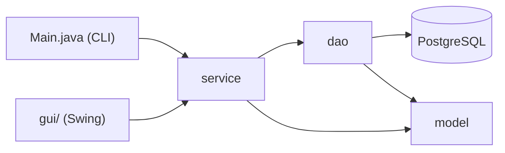
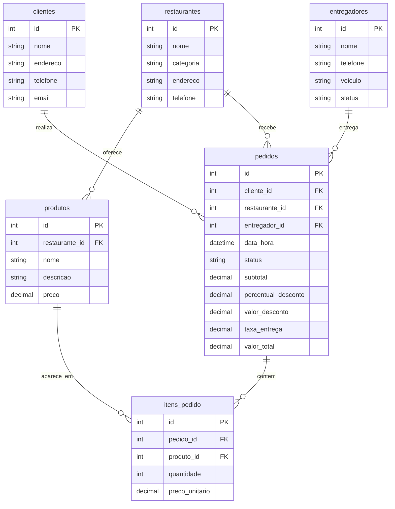

# 🍔 Sistema de Delivery de Comida


Sistema de gerenciamento de delivery de comida desenvolvido em **Java** com persistência em **PostgreSQL**, criado como projeto acadêmico interdisciplinar (Programação Orientada a Objetos + Banco de Dados). Gerencia restaurantes, produtos, clientes, entregadores e todo o ciclo de vida de um pedido — do cadastro à entrega — com cálculo automático de descontos progressivos.

Possui **duas interfaces**: uma aplicação de linha de comando (o requisito original do projeto) e uma interface gráfica em **Java Swing**, ambas reaproveitando exatamente as mesmas regras de negócio.

---

## 📋 Índice

- [Funcionalidades](#-funcionalidades)
- [Tecnologias](#-tecnologias)
- [Arquitetura](#-arquitetura)
- [Modelo de dados](#-modelo-de-dados)
- [Regra de negócio: desconto progressivo](#-regra-de-negócio-desconto-progressivo)
- [Como executar](#-como-executar)
- [Estrutura do projeto](#-estrutura-do-projeto)
- [Possíveis evoluções](#-possíveis-evoluções)

---

## ✨ Funcionalidades

- **CRUD completo** de restaurantes, produtos, clientes e entregadores
- **Criação de pedidos** com múltiplos itens e cálculo automático de valores
- **Desconto progressivo** por faixa de valor (5% / 10% / 15%)
- **Atribuição de entregadores** respeitando a regra de disponibilidade
- **Acompanhamento de status** do pedido (pendente → confirmado → em preparo → saiu para entrega → entregue)
- **Relatórios** de total de pedidos e valor vendido por restaurante
- **Duas interfaces**: CLI (linha de comando) e GUI (Swing)

## 🛠 Tecnologias

| Camada | Tecnologia |
|---|---|
| Linguagem | Java 17 |
| Persistência | PostgreSQL 13+ via JDBC puro (sem ORM) |
| Build | Maven |
| Interface gráfica | Java Swing |
| Interface de linha de comando | `java.util.Scanner` |

## 🏗 Arquitetura

O projeto segue uma separação clássica em camadas, o que permitiu construir a interface gráfica **sem alterar uma única linha** da lógica de negócio ou de acesso a dados:

```
model/        → entidades do domínio (POJOs) e enums de status
dao/          → acesso a dados via JDBC (todo o SQL vive aqui)
service/      → regras de negócio (descontos, atribuição de entregador)
Main.java     → apresentação: menu em linha de comando
gui/          → apresentação: interface gráfica Swing
```



## 🗄 Modelo de dados



> `itens_pedido` é a tabela associativa que resolve o relacionamento N:N entre `pedidos` e `produtos`, guardando o preço unitário no momento da compra (o histórico do pedido não muda se o preço do produto for atualizado depois).

## 💰 Regra de negócio: desconto progressivo

Ao finalizar um pedido, o sistema calcula (em `service/PedidoService.java`):

1. **Subtotal** = soma de `preço unitário × quantidade` de cada item
2. **Desconto** = aplica-se **apenas o percentual da maior faixa atingida** (não é cumulativo):

   | Subtotal | Desconto |
   |---|---|
   | até R$ 100,00 | 0% |
   | acima de R$ 100,00 | 5% |
   | acima de R$ 200,00 | 10% |
   | acima de R$ 300,00 | 15% |

3. **Taxa de entrega** fixa de R$ 8,00, somada após o desconto
4. **Valor final** = subtotal − desconto + taxa de entrega

Todos os valores monetários usam `BigDecimal` (nunca `double`), evitando erros de arredondamento de ponto flutuante.

## 🚀 Como executar

### Pré-requisitos
- JDK 17+
- Apache Maven 3.8+
- PostgreSQL 13+

### 1. Banco de dados
```bash
psql -U postgres -c "CREATE DATABASE delivery_db;"
psql -U postgres -d delivery_db -f sql/schema.sql
```

### 2. Configuração
Copie o arquivo de exemplo e ajuste com sua senha do PostgreSQL:
```bash
cp src/main/resources/config.properties.example src/main/resources/config.properties
```

### 3. Compilar
```bash
mvn clean package
```

### 4. Executar
```bash
# Versão em linha de comando
java -jar target/delivery-system-jar-with-dependencies.jar

# Versão com interface gráfica (Swing)
java -cp target/delivery-system-jar-with-dependencies.jar com.delivery.MainGui
```

## 📁 Estrutura do projeto

```
delivery-system/
├── pom.xml
├── sql/schema.sql
└── src/main/
    ├── resources/config.properties.example
    └── java/com/delivery/
        ├── Main.java              # CLI
        ├── MainGui.java           # ponto de entrada da GUI
        ├── model/                 # entidades e enums
        ├── dao/                   # acesso a dados (JDBC)
        ├── service/               # regras de negócio
        └── gui/                   # telas Swing
```

## 🔮 Possíveis evoluções

- [ ] Testes unitários (JUnit) para a camada `service`
- [ ] Validações mais completas de entrada (e-mail, telefone, CPF)
- [ ] Cancelamento de pedido com liberação automática do entregador
- [ ] Migração para uma API REST (Spring Boot) com front-end web

---

Projeto acadêmico desenvolvido para a matéria de modelagem de Banco de Dados.
